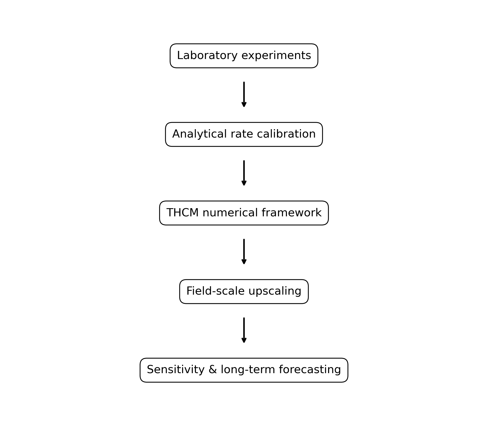
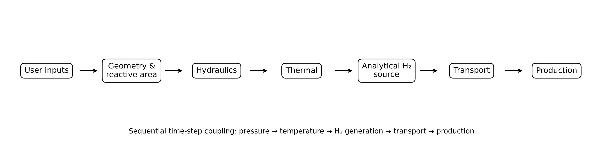
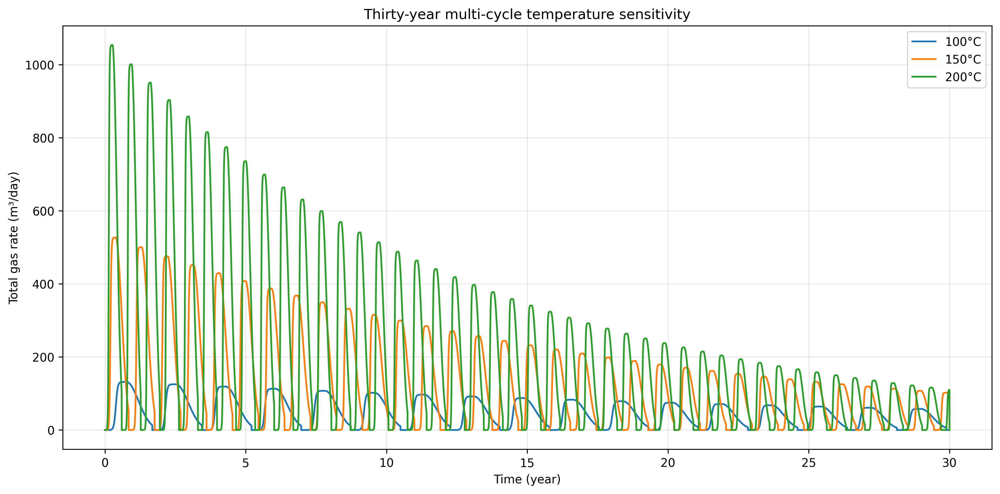
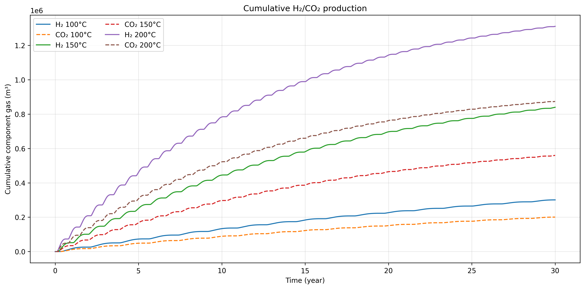
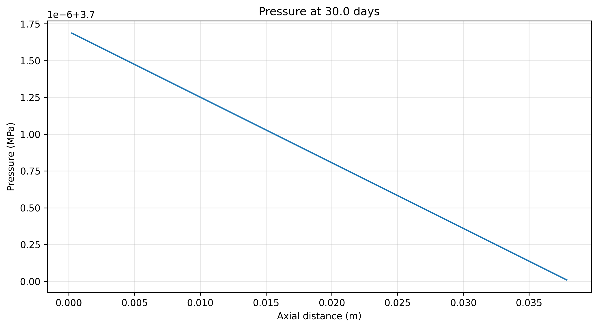
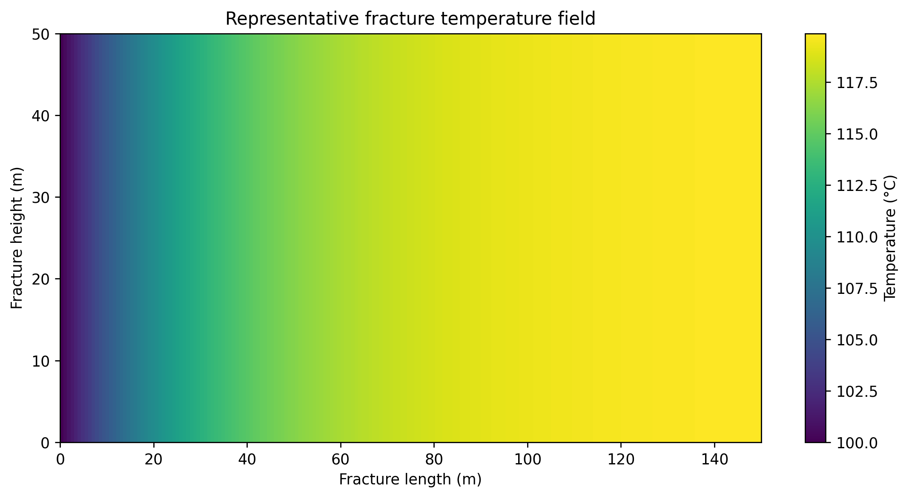
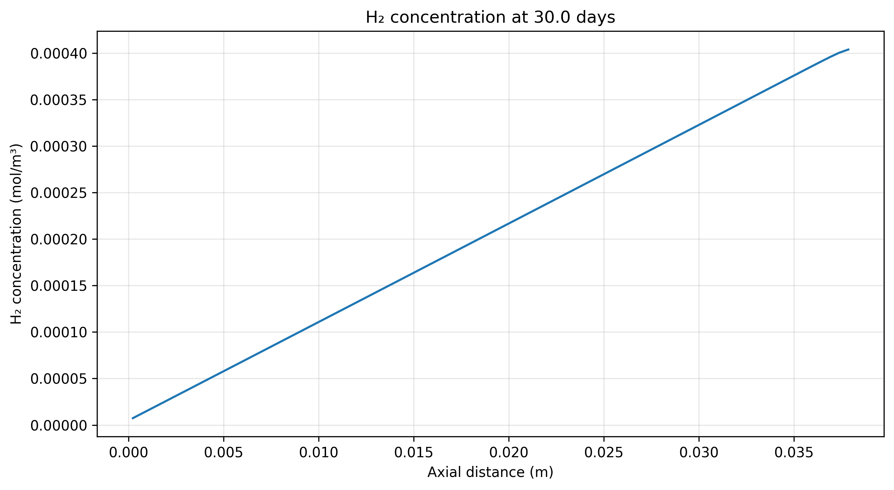

# Analytical-Rate-Anchored THCM Hydrogen Simulator

This repository contains a reduced-order thermal-hydraulic-chemical-mechanical (THCM) simulator for hydrogen generation through serpentinization. The laboratory-calibrated analytical hydrogen-generation equation is used as the governing source term, while the numerical model calculates flow, temperature, hydrogen transport, storage, production, and optional fracture-aperture feedback.



## Repository contents

| File | Description |
|---|---|
| `01_THCM_Hydrogen_Simulator.ipynb` | Main self-contained simulator notebook. |
| `02_Sensitivity_Studies.ipynb` | Temperature, fracture-area, refracturing, and H2/CO2 sensitivity studies. |
| `requirements.txt` | Required Python packages. |
| `LICENSE` | MIT License. |
| `images/` | Workflow and representative output figures. |

## Main methodology



The generated hydrogen is distributed conservatively through the fracture and transported to the producer using an advection-diffusion balance.

## Installation

Python 3.10 or newer is recommended.

```bash
pip install -r requirements.txt
```

Then start Jupyter:

```bash
jupyter notebook
```

## Running the notebooks

1. Open `01_THCM_Hydrogen_Simulator.ipynb`.
2. Select **Kernel > Restart & Run All**.
3. Review the laboratory and field-scale results.
4. Open `02_Sensitivity_Studies.ipynb` and run all cells for temperature, area, multi-cycle refracturing, and gas-composition studies.

Both notebooks are self-contained; no external `src/` package is required.

## Representative outputs

### Production rate



### Cumulative production



### Pressure, temperature, and concentration

| Pressure | Temperature | H2 concentration |
|---|---|---|
|  |  |  |

## Sensitivity controls

The notebooks allow the user to modify:

- reservoir/fracture temperature;
- fracture length, height, aperture, and fracture count;
- reactive area and area-scaling exponent;
- injection rate and injection-rate scaling;
- simulation duration and time-step size;
- refracturing threshold, downtime, and peak retention;
- fixed CO2 impurity fraction.

## Model scope

This is a reduced-order research model. The current version does not solve complete mineral speciation, multiphase gas-water flow, fracture propagation, or full stress equilibrium. Field-scale cases should be interpreted as analytical-rate-anchored screening forecasts.

## Citation

Not available yet.

## License

Released under the MIT License.
